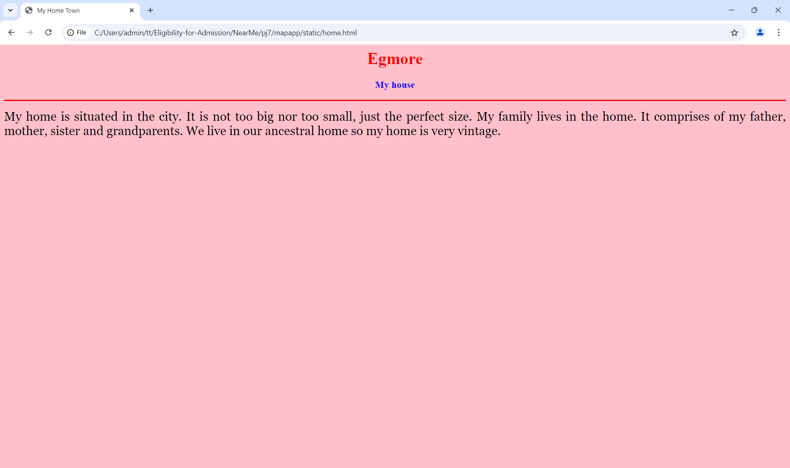

# Ex04 Places Around Me
## Date:11/12/2024

## AIM
To develop a website to display details about the places around my house.

## DESIGN STEPS

### STEP 1
Create a Django admin interface.

### STEP 2
Download your city map from Google.

### STEP 3
Using ```<map>``` tag name the map.

### STEP 4
Create clickable regions in the image using ```<area>``` tag.

### STEP 5
Write HTML programs for all the regions identified.

### STEP 6
Execute the programs and publish them.

## CODE
```
map.html

<html>
<head>
<title>My City</title>
</head>
<body>
<h1 align="center">
<font color="red"><b>Egmore</b></font>
</h1>
<h3 align="center">
<font color="blue"><b>K.Mohamed Althaf(24005994)</b></font>
</h3>
<center>

<map name="MyCity">
<area shape="rect" coords="684,420,772,505" href="home.html" title="My Home Town">
<area shape="circle" coords="798,700,48" href="museum.html" title="Government Museum,Egmore">
<area shape="circle" coords="1783,994,33" href="stadium.html" title="MA Chidambaram Stadium">
<area shape="rect" coords="1032,1090,882,1042" href="mall.html" title="Spencer Plaza">
<area shape="circle" coords="566,983,53" href="hospital.html" title="Apollo Hospitals">
</map>
</center>
</body>
</html>

museum.html

<html>
<head>
<title>My Home Town</title>
</head>

<body bgcolor="pink">

<h1 align="center">

<font color="red"><b>Egmore</b></font>

</h1>

<h3 align="center">

<font color="blue"><b>Government Museum</b></font>

</h3>

<hr size="3" color="red">

<p align="justify">

<font face="Georgia" size="5">
The museum is located in what is known as the Pantheon complex, or "public assembly rooms."It is located in the Government 
Museum Complex on Pantheon Road in Egmore.The road on which the museum is located too takes its name from the complex. 
The Government Museum Complex also houses the Connemara Public Library and the National Art Gallery.
</p>

</body>

</html>

stadium.html

<html>
<head>
<title>My Home Town</title>
</head>

<body bgcolor="pink">

<h1 align="center">

<font color="red"><b>Egmore</b></font>

</h1>

<h3 align="center">

<font color="blue"><b>MA Chidambaram Stadium</b></font>

</h3>

<hr size="3" color="red">

<p align="justify">

<font face="Georgia" size="5">
M. A. Chidambaram Stadium, commonly known as the Chepauk Stadium, is a cricket stadium in Chepauk, Chennai.
It is named after former BCCI president M. A. Chidambaram, and is operated by the Tamil Nadu Cricket Association. 
It was established in 1916 and is the second oldest international cricket stadium in the country that is still in use after the Eden Gardens.
</p>

</body>

</html>

mall.html

<html>
<head>
<title>My Home Town</title>
</head>

<body bgcolor="pink">

<h1 align="center">

<font color="red"><b>Egmore</b></font>

</h1>

<h3 align="center">

<font color="blue"><b>Spencer Plaza</b></font>

</h3>

<hr size="3" color="red">

<p align="justify">

<font face="Georgia" size="5">
Spencer Plaza is a shopping mall located on Anna Salai in Chennai, Tamil Nadu, India, and is one of the modern landmarks of the city. 
Originally built during the period of the British Raj and reconstructed in 1985 on the site of the original Spencer's department store, 
it is the oldest shopping mall in India and was one of the biggest shopping malls in South Asia when it was built.
</p>

</body>

</html>

hospital.html

<html>
<head>
<title>My Home Town</title>
</head>

<body bgcolor="pink">

<h1 align="center">

<font color="red"><b>Egmore</b></font>

</h1>

<h3 align="center">

<font color="blue"><b>Apollo Hospital</b></font>

</h3>

<hr size="3" color="red">

<p align="justify">

<font face="Georgia" size="5">
Apollo Hospitals Enterprise Limited is an Indian multinational healthcare group headquartered in Chennai.It is the largest for-profit 
private hospital network in India, with a network of 71 owned and managed hospitals.Along with the eponymous hospital chain, 
the company also operates pharmacies, primary care and diagnostic centres, telehealth clinics, and digital healthcare services among 
others through its subsidiaries.
</p>

</body>

</html>

```

## OUTPUT




## RESULT
The program for implementing image maps using HTML is executed successfully.
